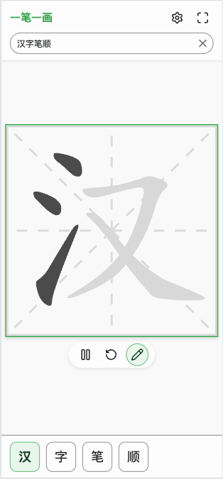
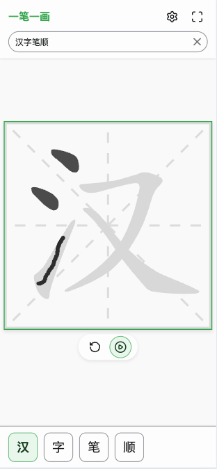
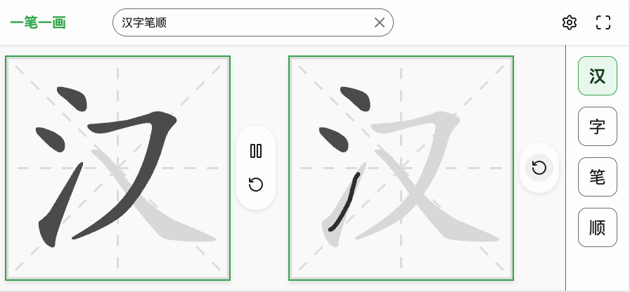
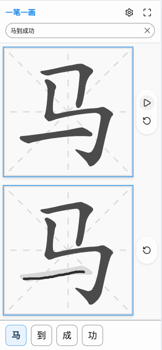

# WriteRight (一笔一画)

[](https://opensource.org/licenses/MIT)
[](https://web.dev/progressive-web-apps/)

[English](#english) | [简体中文](#简体中文) | [繁體中文](#繁體中文)









---

<a id="english"></a>

## English

**WriteRight** is a minimalist PWA application dedicated to fast Chinese character stroke order lookup and fostering correct writing habits. It removes all redundant features to provide the fastest and most standard writing guidance for learners.

> **"One stroke at a time, strictly standardized."**

### 🌐 Official Website

- [https://writeright.pipecraft.net/](https://writeright.pipecraft.net/)
- [https://ybyh.pipecraft.net/](https://ybyh.pipecraft.net/)

### ✨ Key Features

- **📝 Standardized Stroke Order**: Strictly follows modern standard Chinese stroke orders with dynamic animations.
- **⚡️ Instant Lookup**: Supports multi-character input with auto-generated lists. Switch characters instantly.
- **🎨 Minimalist Design**: Built with **Material Design 3**. Pure interface, no ads, no social distractions.
- **📱 PWA Support**: Fully offline-capable. Install it on your device for a native-like experience without network.
- **✍️ Practice Mode**: Built-in grid backgrounds (Rice/Field grids) for handwriting practice.
- **🛡️ Privacy First**:
  - **Zero Data Collection**: No user profiling, no registration required.
  - **Zero Uploads**: All processing is done locally.
  - **Zero Permissions**: No requests for location, camera, or contacts.

### 🧧 Mobile Decoration

Transform your home screen into a digital couplet:

- **Custom Styles**: Choose between Red/Gold (Festive) or Red/Black (Classic) themes.
- **"Fortune Arrives"**: Enable 180° rotation to create the traditional "Upside Down Fu" icon.
- **Full Customization**: Freely adjust background and text colors to match your wallpaper.

> **Tip**: After adding it once, you need to refresh the page for the new text to take effect.

### 📱 Install App (PWA)

1. Open the website in Android Chrome or iOS Safari.
2. Tap **"Add to Home Screen"** or **"Install App"** in the browser menu.
3. Launch it from your home screen just like a native app.

### 🛠️ Tech Stack

"Lightweight" and "High Performance":

- **Language**: TypeScript (Strict Mode)
- **Engine**: [Hanzi Writer](https://github.com/chanind/hanzi-writer) (Core stroke engine)
- **Bundler**: [esbuild](https://esbuild.github.io/) (Ultra-fast compilation)
- **Icons**: [Lucide](https://lucide.dev/)
- **Architecture**: Zero-Backend, Privacy-First static site.

### 🚀 Getting Started

```bash
# Install dependencies
npm install

# Start development server
npm run dev

# Build for production
npm run build
```

### 📄 License

This project is licensed under the [MIT License](LICENSE).

### 👏 Acknowledgments

- Thanks to [bopomofo](https://2libra.com/user/bopomofo/about?iid=1AeoTgXc) for suggesting the app name.

---

<a id="简体中文"></a>

## 简体中文

**一笔一画 (WriteRight)** 是一款专注于汉字笔顺查询与规范书写习惯养成的极简 PWA 应用。它剔除了所有冗余功能，旨在为汉字初学者提供最快速、最标准的书写指导。

> **“一笔一画，正本清源。”**

### 🌐 官方网站

- [https://writeright.pipecraft.net/](https://writeright.pipecraft.net/)
- [https://ybyh.pipecraft.net/](https://ybyh.pipecraft.net/)

### ✨ 核心特性

- **📝 规范笔顺演示**：严格遵循现代汉语通用字笔顺规范，动态展示每一笔的先后顺序。
- **⚡️ 一键快查**：支持多字输入，自动生成书写列表，点击即可切换，响应速度极快。
- **🎨 极简主义设计**：采用 **Material Design 3** 设计语言，界面纯净，无广告、无社交干扰。
- **📱 离线使用 (PWA)**：基于 Progressive Web App 技术，安装后在无网络环境下依然可以正常运行。
- **✍️ 练习模式**：内置米字格/田字格背景，支持手写跟随练习，纠正书写习惯。
- **🛡️ 隐私声明**：
  - **零数据收集**：本应用不建立任何用户画像，不要求注册登录。
  - **零隐私上传**：所有汉字查询与书写行为均在本地完成，不会上传至任何服务器。
  - **零权限索取**：不申请地理位置、摄像头、通讯录等敏感权限。

### 🧧 手机装饰

将您的手机主屏幕变成电子春联：

- **自定义风格**：提供红底金字、红底黑字等传统对联配色。
- **倒贴福字**：开启“图标倒置 (180°)”，一键制作“福到了”吉祥图标。
- **个性配色**：支持任意调整背景与文字颜色，打造独一无二的桌面装饰。

> **友情提示**：添加过一次以后，需要刷新页面，新的文字才会生效。

### 📱 安装应用 (PWA)

1. 使用 Android Chrome 或 iOS Safari 访问应用网址。
2. 菜单中选择 **“安装应用”** 或 **“添加到主屏幕”**。
3. 即可像原生应用一样从桌面启动。

### 🛠️ 技术栈

本应用坚持“轻量化”与“高性能”的开发原则：

- **语言**: TypeScript (Strict Mode)
- **引擎**: [Hanzi Writer](https://github.com/chanind/hanzi-writer) (核心笔顺引擎)
- **构建**: [esbuild](https://esbuild.github.io/) (极速编译)
- **图标**: [Lucide](https://lucide.dev/)
- **架构**: 无后端 (Zero-Backend)，隐私优先。

### 🚀 快速开始

```bash
# 安装依赖
npm install

# 启动开发服务器
npm run dev

# 构建生产版本
npm run build
```

### 📄 开源协议

本项目采用 [MIT License](LICENSE) 开源。

### 👏 致谢

- 感谢 [bopomofo](https://2libra.com/user/bopomofo/about?iid=1AeoTgXc) 提供应用名称建议。

---

<a id="繁體中文"></a>

## 繁體中文

**一筆一畫 (WriteRight)** 是一款專注於漢字筆順查詢與規範書寫習慣養成的極簡 PWA 應用。它剔除了所有冗餘功能，旨在為漢字初學者提供最快速、最標準的書寫指導。

> **“一筆一畫，正本清源。”**

### 🌐 官方網站

- [https://writeright.pipecraft.net/](https://writeright.pipecraft.net/)
- [https://ybyh.pipecraft.net/](https://ybyh.pipecraft.net/)

### ✨ 核心特性

- **📝 規範筆順演示**：嚴格遵循現代漢語通用字筆順規範，動態展示每一筆的先後順序。
- **⚡️ 一鍵快查**：支持多字輸入，自動生成書寫列表，點擊即可切換，響應速度極快。
- **🎨 極簡主義設計**：採用 **Material Design 3** 設計語言，界面純淨，無廣告、無社交干擾。
- **📱 離線使用 (PWA)**：基於 Progressive Web App 技術，安裝後在無網絡環境下依然可以正常運行。
- **✍️ 練習模式**：內置米字格/田字格背景，支持手寫跟隨練習，糾正書寫習慣。
- **🛡️ 隱私聲明**：
  - **零數據收集**：本應用不建立任何用戶畫像，不要求註冊登錄。
  - **零隱私上傳**：所有漢字查詢與書寫行為均在本地完成，不會上傳至任何服務器。
  - **零權限索取**：不申請地理位置、攝像頭、通訊錄等敏感權限。

### 🧧 手機裝飾

將您的手機主屏幕變成電子春聯：

- **自定義風格**：提供紅底金字、紅底黑字等傳統對聯配色。
- **倒貼福字**：開啟“圖標倒置 (180°)”，一鍵製作“福到了”吉祥圖標。
- **個性配色**：支持任意調整背景與文字顏色，打造獨一無二的桌面裝飾。

> **友情提示**：添加過一次以後，需要刷新頁面，新的文字才會生效。

### 📱 安裝應用 (PWA)

1. 使用 Android Chrome 或 iOS Safari 訪問應用網址。
2. 菜單中選擇 **“安裝應用”** 或 **“添加到主屏幕”**。
3. 即可像原生應用一樣從桌面啟動。

### 🛠️ 技術棧

本應用堅持“輕量化”與“高性能”的開發原則：

- **語言**: TypeScript (Strict Mode)
- **引擎**: [Hanzi Writer](https://github.com/chanind/hanzi-writer) (核心筆順引擎)
- **構建**: [esbuild](https://esbuild.github.io/) (極速編譯)
- **圖標**: [Lucide](https://lucide.dev/)
- **架構**: 無後端 (Zero-Backend)，隱私優先。

### 🚀 快速開始

```bash
# 安裝依賴
npm install

# 啟動開發服務器
npm run dev

# 構建生產版本
npm run build
```

### 📄 開源協議

本項目基於 [MIT License](LICENSE) 開源。

### 👏 致謝

- 感謝 [bopomofo](https://2libra.com/user/bopomofo/about?iid=1AeoTgXc) 提供應用名稱建議。
